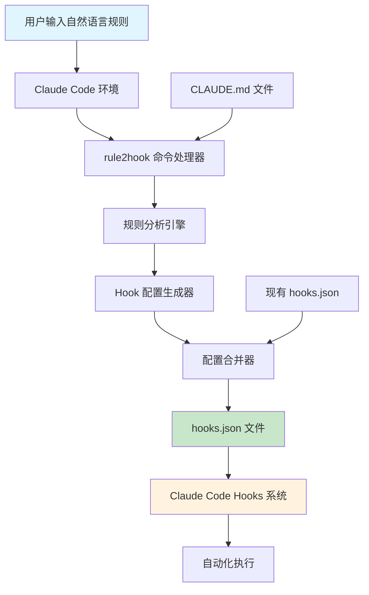
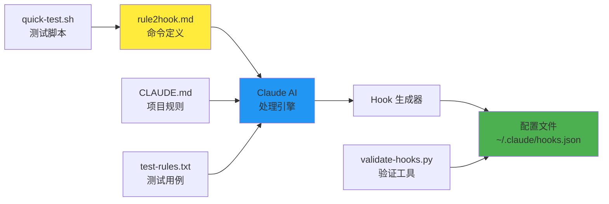
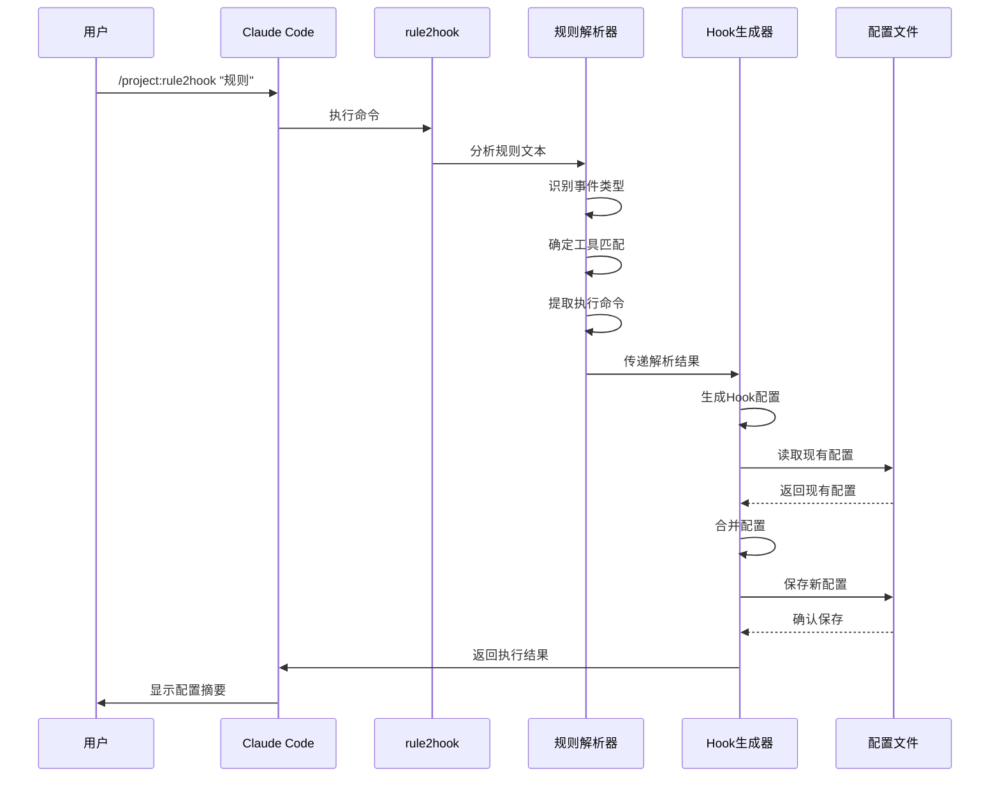

# claudecode-rule2hook 技术文档

## 目录

- [项目概述](#项目概述)
- [技术栈](#技术栈)
- [项目架构](#项目架构)
- [目录结构](#目录结构)
- [安装和运行指南](#安装和运行指南)
- [核心功能模块](#核心功能模块)
- [数据流程](#数据流程)
- [配置文件说明](#配置文件说明)
- [开发指南](#开发指南)
- [常见问题](#常见问题)

## 项目概述

### 功能介绍

claudecode-rule2hook 是一个智能化的自动化工具，专为 Claude Code 开发环境设计。它的核心功能是将用户用自然语言描述的项目规则自动转换为 Claude Code 的 hooks 配置，实现开发流程的自动化。

### 主要特性

- **自然语言处理**: 支持用纯英文描述项目规则
- **智能转换**: 自动识别触发事件、目标工具和执行命令
- **零依赖**: 直接与 Claude Code 集成，无需额外依赖
- **安全配置**: 自动备份现有配置，支持配置合并
- **多种安装方式**: 支持项目级和全局安装

### 应用场景

- 代码格式化自动化（如 Python 文件保存后自动运行 black）
- Git 工作流自动化（如任务完成后自动运行 git status）
- 测试自动化（如修改测试文件后自动运行测试）
- 安全检查（如提交前检查硬编码密钥）
- 自定义工作流（如部署前的多步骤验证）

## 技术栈

### 核心技术

- **Claude Code**: Anthropic 的 AI 辅助开发环境
- **Markdown**: 用于命令定义和文档
- **JSON**: 用于 hooks 配置存储
- **Shell Script**: 用于测试和验证工具
- **Python**: 用于配置验证和测试

### 开发工具

- **Git**: 版本控制
- **Bash**: 脚本执行环境
- **JSON Schema**: 配置验证

### 依赖关系

项目设计为零外部依赖，仅依赖：
- Claude Code 环境
- 标准 Unix/Linux 工具（bash, cat, cp 等）
- Python 3.x（仅用于验证工具）

## 项目架构

### 系统架构图



### 组件关系图



## 目录结构

```
claudecode-rule2hook/
├── .claude/                    # Claude Code 配置目录
│   └── commands/              # 自定义命令目录
│       └── rule2hook.md       # 核心命令定义文件
├── examples/                  # 示例和模板
│   └── sample_rules.md        # 示例规则集合
├── CHANGELOG.md               # 版本更新日志
├── CLAUDE.md                  # 项目规则定义
├── CODE_OF_CONDUCT.md         # 行为准则
├── CONTRIBUTING.md            # 贡献指南
├── LICENSE                    # MIT 许可证
├── QUICKSTART.md              # 快速开始指南
├── README.md                  # 项目说明文档
├── SECURITY.md                # 安全政策
├── quick-test.sh              # 交互式测试脚本
├── test-cases.md              # 详细测试用例
├── test-rules.txt             # 测试规则集合
└── validate-hooks.py          # Hook 配置验证工具
```

### 核心文件说明

- **`.claude/commands/rule2hook.md`**: 项目的核心，定义了完整的规则转换逻辑
- **`validate-hooks.py`**: Python 验证工具，确保生成的 hooks 配置正确
- **`quick-test.sh`**: 交互式测试脚本，帮助开发者测试功能
- **`CLAUDE.md`**: 项目规则示例，展示如何定义项目规则

## 安装和运行指南

### 环境要求

- Claude Code 开发环境
- Unix/Linux 或 macOS 系统
- Python 3.x（可选，用于验证工具）
- Git（用于克隆项目）

### 安装步骤

#### 方式一：项目级安装（推荐）

```bash
# 1. 克隆项目
git clone https://github.com/zxdxjtu/claudecode-rule2hook.git

# 2. 进入目标项目目录
cd your-project

# 3. 创建 Claude 命令目录
mkdir -p .claude/commands

# 4. 复制命令文件
cp /path/to/claudecode-rule2hook/.claude/commands/rule2hook.md .claude/commands/

# 5. 验证安装
ls -la .claude/commands/rule2hook.md
```

#### 方式二：全局安装

```bash
# 1. 克隆项目
git clone https://github.com/zxdxjtu/claudecode-rule2hook.git

# 2. 创建全局命令目录
mkdir -p ~/.claude/commands

# 3. 复制命令文件
cp claudecode-rule2hook/.claude/commands/rule2hook.md ~/.claude/commands/

# 4. 验证安装
ls -la ~/.claude/commands/rule2hook.md
```

### 基本使用

#### 单个规则转换

```bash
# 项目级安装使用方式
/project:rule2hook "Format Python files with black after editing"

# 全局安装使用方式
/rule2hook "Format Python files with black after editing"
```

#### 从 CLAUDE.md 读取规则

```bash
# 创建规则文件
cat > CLAUDE.md << EOF
# Project Rules
- Format Python files with black after editing
- Run tests before committing
- Check for TODO comments before pushing
EOF

# 执行转换
/project:rule2hook
```

#### 多规则转换

```bash
/project:rule2hook "Run tests after editing, Format code before committing"
```

### 验证安装

```bash
# 检查生成的配置
cat ~/.claude/hooks.json

# 使用验证工具
python3 validate-hooks.py

# 运行测试脚本
./quick-test.sh
```

## 核心功能模块

### 1. 规则解析模块

**位置**: `.claude/commands/rule2hook.md` (第13-16行)

**功能**: 分析自然语言规则，识别：
- 触发事件类型（before/after/when）
- 目标工具（Edit/Write/Bash等）
- 执行命令

**关键算法**:
```markdown
For each rule, determine:
- The appropriate hook event (PreToolUse, PostToolUse, Stop, Notification)
- The tool matcher pattern (exact tool names or regex)
- The command to execute
```

### 2. Hook 事件映射模块

**支持的事件类型**:

- **PreToolUse**: 工具执行前触发
  - 关键词: "before", "check", "validate", "prevent"
  - 用途: 验证、安全检查、预处理

- **PostToolUse**: 工具执行后触发
  - 关键词: "after", "following", "once done"
  - 用途: 格式化、构建、测试

- **Stop**: Claude Code 响应完成时触发
  - 关键词: "finish", "complete", "end task"
  - 用途: 状态检查、清理、总结

- **Notification**: 通知时触发
  - 关键词: "notify", "alert", "inform"
  - 用途: 消息通知、日志记录

### 3. 工具匹配模块

**支持的工具类型**:
```
Task, Bash, Glob, Grep, Read, Edit, MultiEdit, Write, 
WebFetch, WebSearch, TodoRead, TodoWrite
```

**匹配模式**:
- 精确匹配: `"Edit"`
- 多工具匹配: `"Edit|MultiEdit|Write"`
- 正则表达式: `".*Edit"`

### 4. 配置生成模块

**生成的配置结构**:
```json
{
  "hooks": {
    "EventName": [{
      "matcher": "ToolPattern",
      "hooks": [{
        "type": "command",
        "command": "shell-command"
      }]
    }]
  }
}
```

### 5. 配置合并模块

**功能**: 
- 读取现有的 `~/.claude/hooks.json`
- 智能合并新配置
- 避免重复和冲突
- 保持配置完整性

## 数据流程

### 完整数据流程图



### 规则处理流程

1. **输入阶段**
   - 用户输入自然语言规则
   - 或从 CLAUDE.md 文件读取规则

2. **解析阶段**
   - 识别触发关键词（before/after/when）
   - 确定目标工具类型
   - 提取具体执行命令

3. **生成阶段**
   - 映射到对应的 Hook 事件
   - 生成工具匹配模式
   - 构建完整的 Hook 配置

4. **应用阶段**
   - 读取现有配置文件
   - 智能合并新旧配置
   - 保存到 `~/.claude/hooks.json`

### 示例数据流

**输入**: `"Format Python files with black after editing"`

**解析结果**:
- 事件类型: PostToolUse（关键词 "after"）
- 工具匹配: Edit|MultiEdit|Write（关键词 "editing"）
- 执行命令: black . --quiet（从 "black" 推导）

**生成配置**:
```json
{
  "hooks": {
    "PostToolUse": [{
      "matcher": "Edit|MultiEdit|Write",
      "hooks": [{
        "type": "command",
        "command": "black . --quiet 2>/dev/null || true"
      }]
    }]
  }
}
```

## 配置文件说明

### hooks.json 配置文件

**位置**: `~/.claude/hooks.json`

**作用**: Claude Code 的核心配置文件，定义所有自动化 hooks

**基本结构**:
```json
{
  "hooks": {
    "PreToolUse": [
      {
        "matcher": "工具匹配模式",
        "hooks": [
          {
            "type": "command",
            "command": "要执行的命令"
          }
        ]
      }
    ],
    "PostToolUse": [...],
    "Stop": [...],
    "Notification": [...]
  }
}
```

### CLAUDE.md 规则文件

**位置**: 项目根目录或 `~/.claude/CLAUDE.md`

**作用**: 存储项目规则的文档文件

**示例格式**:
```markdown
# Project Rules

## Code Quality
- Format Python files with black after editing
- Run prettier on JavaScript files after saving

## Testing
- Run tests after modifying test files
- Validate JSON schema before saving .json files

## Git Workflow
- Run git status when finishing tasks
- Check for TODO comments before committing
```

### 配置优先级

1. 命令行参数规则（最高优先级）
2. `./CLAUDE.md`（项目级规则）
3. `./CLAUDE.local.md`（本地项目规则）
4. `~/.claude/CLAUDE.md`（用户级规则）

## 开发指南和最佳实践

### 开发环境设置

```bash
# 1. 克隆开发版本
git clone https://github.com/zxdxjtu/claudecode-rule2hook.git
cd claudecode-rule2hook

# 2. 设置开发环境
mkdir -p ~/.claude/commands
ln -sf $(pwd)/.claude/commands/rule2hook.md ~/.claude/commands/

# 3. 验证开发环境
ls -la ~/.claude/commands/rule2hook.md
```

### 规则编写最佳实践

#### 1. 清晰的触发词使用

**推荐**:
```
"Format Python files after editing"     # 明确的 "after"
"Check for secrets before committing"   # 明确的 "before"
"Run tests when finishing tasks"        # 明确的 "when"
```

**避免**:
```
"Make code clean"                        # 模糊的描述
"Handle Python files"                    # 不明确的时机
```

#### 2. 具体的工具和命令

**推荐**:
```
"Run black on Python files after editing"
"Execute npm test after modifying test files"
"Run git status when completing tasks"
```

**避免**:
```
"Format files"                           # 不明确的格式化工具
"Run tests"                             # 不明确的测试命令
```

#### 3. 安全的命令设计

**推荐**:
```bash
# 添加错误处理
"black . --quiet 2>/dev/null || true"

# 使用安全标志
"eslint --fix --quiet"

# 检查文件存在
"[ -f package.json ] && npm test"
```

**避免**:
```bash
# 可能失败的命令
"black ."

# 危险的操作
"rm -rf node_modules && npm install"
```

### 测试和调试

#### 使用测试脚本

```bash
# 运行交互式测试
./quick-test.sh

# 验证生成的配置
python3 validate-hooks.py

# 测试特定规则
/project:rule2hook "$(cat test-rules.txt | head -1)"
```

#### 调试技巧

1. **检查生成的配置**:
```bash
cat ~/.claude/hooks.json | python3 -m json.tool
```

2. **验证配置语法**:
```bash
python3 validate-hooks.py ~/.claude/hooks.json
```

3. **测试 Hook 执行**:
```bash
# 创建测试文件触发 hook
echo "def test(): pass" > test.py
# 在 Claude Code 中编辑文件，观察 hook 是否执行
```

### 扩展开发

#### 添加新的规则模式

1. **在 rule2hook.md 中添加模式识别**:
```markdown
## New Pattern Recognition
- **Keywords**: "deploy", "build", "package"
- **Event**: PostToolUse
- **Tools**: Write|Edit
- **Command**: npm run build
```

2. **添加示例**:
```markdown
### Example: Build Automation
**Rule**: "Build project after modifying source files"
**Analysis**:
- "after modifying" → PostToolUse
- "source files" → Edit|MultiEdit|Write
```

3. **添加测试用例**:
```bash
echo "Build project after modifying source files" >> test-rules.txt
```

#### 自定义命令处理

可以在 rule2hook.md 中添加特殊的命令处理逻辑：

```markdown
## Custom Command Processing

### Docker Commands
- Pattern: "docker build", "docker run"
- Safety: Add --quiet flag, error handling

### Database Commands
- Pattern: "migrate", "seed", "backup"
- Safety: Add confirmation prompts, backup checks
```

## 常见问题和故障排除

### 安装问题

**Q: 命令不可用，显示 "Unknown command"**

A: 检查以下几点：
```bash
# 1. 确认文件存在
ls -la .claude/commands/rule2hook.md

# 2. 确认在正确目录
pwd  # 应该在项目根目录

# 3. 重启 Claude Code
# 退出并重新启动 Claude Code
```

**Q: 全局安装后仍然需要 /project: 前缀**

A: 检查全局安装：
```bash
# 确认全局文件存在
ls -la ~/.claude/commands/rule2hook.md

# 确认目录权限
ls -ld ~/.claude/commands/
```

### 配置问题

**Q: 生成的 hooks 不执行**

A: 验证配置：
```bash
# 1. 检查配置语法
python3 validate-hooks.py

# 2. 检查命令是否可执行
black --version  # 测试命令是否存在

# 3. 检查文件权限
ls -la ~/.claude/hooks.json
```

**Q: hooks.json 被覆盖**

A: 恢复备份：
```bash
# 查找备份文件
ls -la ~/.claude/hooks.json*

# 恢复备份
cp ~/.claude/hooks.json.backup ~/.claude/hooks.json
```

### 规则解析问题

**Q: 规则没有被正确解析**

A: 检查规则格式：
```bash
# 1. 使用明确的触发词
"after editing" ✓
"when done" ✓
"before saving" ✓

# 2. 避免模糊描述
"make clean" ✗
"handle files" ✗

# 3. 测试简单规则
/project:rule2hook "Run git status when finishing tasks"
```

**Q: 复杂规则解析失败**

A: 分解为简单规则：
```bash
# 复杂规则
"Run lint, test, and build after editing source files"

# 分解为多个简单规则
/project:rule2hook "Run lint after editing source files"
/project:rule2hook "Run test after editing source files"
/project:rule2hook "Run build after editing source files"
```

### 性能问题

**Q: hooks 执行太慢**

A: 优化命令：
```bash
# 添加 --quiet 标志
"black . --quiet"

# 使用后台执行
"npm test > /dev/null 2>&1 &"

# 添加条件检查
"[ -f package.json ] && npm test"
```

**Q: hooks 执行失败导致 Claude 卡住**

A: 添加错误处理：
```bash
# 添加 || true 防止失败
"black . || true"

# 重定向错误输出
"eslint . 2>/dev/null || echo 'Linting completed'"

# 设置超时
"timeout 30s npm test || echo 'Tests timed out'"
```

### 调试技巧

#### 启用详细日志

```bash
# 创建日志目录
mkdir -p ~/.claude/logs

# 在命令中添加日志
"echo '[$(date)] Running black' >> ~/.claude/logs/hooks.log && black ."
```

#### 测试单个 Hook

```bash
# 手动测试命令
black . --quiet

# 检查退出码
echo $?  # 应该返回 0 表示成功
```

#### 验证工具链

```bash
# 检查所需工具是否安装
which black
which prettier
which eslint

# 检查 Python 环境
python3 --version
pip3 list | grep black
```

### 获取帮助

如果遇到无法解决的问题：

1. **查看项目文档**:
   - [README.md](README.md)
   - [QUICKSTART.md](QUICKSTART.md)
   - [CONTRIBUTING.md](CONTRIBUTING.md)

2. **运行诊断工具**:
```bash
./quick-test.sh
python3 validate-hooks.py
```

3. **提交 Issue**:
   - 访问 [GitHub Issues](https://github.com/zxdxjtu/claudecode-rule2hook/issues)
   - 提供详细的错误信息和环境信息

4. **社区讨论**:
   - [GitHub Discussions](https://github.com/zxdxjtu/claudecode-rule2hook/discussions)
   - [Claude Code 社区](https://docs.anthropic.com/en/docs/claude-code)

---

## 学习资源

### 官方文档

- [Claude Code 文档](https://docs.anthropic.com/en/docs/claude-code) - Claude Code 官方完整文档
- [Hooks 文档](https://docs.anthropic.com/en/docs/claude-code/hooks) - Hooks 系统详细说明
- [Slash Commands 指南](https://docs.anthropic.com/en/docs/claude-code/slash-commands) - 自定义命令开发指南
- [Memory Management](https://docs.anthropic.com/en/docs/claude-code/memory) - 项目记忆管理

### 相关技术学习

- **JSON Schema**: [官方网站](https://json-schema.org/) - 用于配置验证
- **Bash 脚本编程**: [GNU Bash 手册](https://www.gnu.org/software/bash/manual/) - 命令执行环境
- **正则表达式**: [RegExr](https://regexr.com/) - 在线正则表达式测试工具
- **Markdown 语法**: [Markdown Guide](https://www.markdownguide.org/) - 文档编写格式

### 开发工具推荐

- **代码编辑器**: VS Code, Vim, Emacs
- **JSON 工具**: jq, JSON Formatter
- **测试工具**: shellcheck（Shell 脚本检查）
- **版本控制**: Git

### 示例和模板

- [examples/sample_rules.md](examples/sample_rules.md) - 丰富的规则示例
- [test-rules.txt](test-rules.txt) - 测试用例集合
- [CLAUDE.md](CLAUDE.md) - 项目规则模板
- [test-cases.md](test-cases.md) - 详细测试场景

### 进阶学习路径

#### 初学者路径
1. 阅读 [QUICKSTART.md](QUICKSTART.md) 快速上手
2. 运行 `./quick-test.sh` 体验基本功能
3. 尝试编写简单规则
4. 学习基本的 Hook 事件类型

#### 中级开发者路径
1. 深入理解 `.claude/commands/rule2hook.md` 的工作原理
2. 学习复杂规则的编写技巧
3. 掌握配置合并和错误处理
4. 贡献测试用例和文档

#### 高级开发者路径
1. 扩展新的规则模式识别
2. 优化命令生成算法
3. 开发相关工具和插件
4. 参与项目维护和社区建设

### 社区资源

- **GitHub 仓库**: [claudecode-rule2hook](https://github.com/zxdxjtu/claudecode-rule2hook)
- **问题反馈**: [Issues](https://github.com/zxdxjtu/claudecode-rule2hook/issues)
- **功能讨论**: [Discussions](https://github.com/zxdxjtu/claudecode-rule2hook/discussions)
- **贡献指南**: [CONTRIBUTING.md](CONTRIBUTING.md)

---

## 附录

### 支持的规则模式总结

| 模式类型 | 关键词 | Hook 事件 | 示例 |
|---------|--------|-----------|------|
| 代码格式化 | "format", "after editing" | PostToolUse | "Format Python files with black after editing" |
| 测试执行 | "run tests", "after modifying" | PostToolUse | "Run tests after modifying test files" |
| Git 工作流 | "git", "when finishing" | Stop | "Run git status when finishing tasks" |
| 安全检查 | "check", "scan", "before" | PreToolUse | "Check for secrets before committing" |
| 构建部署 | "build", "deploy", "after" | PostToolUse | "Build project after editing source files" |
| 通知提醒 | "notify", "alert", "when" | Notification | "Notify team when deploying to production" |

### 工具匹配模式参考

| 工具类型 | 匹配模式 | 说明 |
|---------|----------|------|
| 文件编辑 | `Edit\|MultiEdit\|Write` | 单文件编辑、批量编辑、文件写入 |
| 命令执行 | `Bash` | Shell 命令执行 |
| 文件操作 | `Read\|Glob\|Grep` | 文件读取、模式匹配、内容搜索 |
| 网络操作 | `WebFetch\|WebSearch` | 网页获取、网络搜索 |
| 任务管理 | `Task\|TodoRead\|TodoWrite` | 任务执行、待办事项管理 |

### 常用命令模板

```bash
# Python 项目
"black . --quiet 2>/dev/null || true"
"flake8 . --quiet || echo 'Linting completed'"
"pytest -q || echo 'Tests completed'"

# JavaScript/Node.js 项目
"prettier --write . --log-level=error || true"
"eslint . --fix --quiet || true"
"npm test --silent || echo 'Tests completed'"

# Git 工作流
"git status --porcelain"
"git diff --cached --name-only"
"git log --oneline -5"

# 安全检查
"git secrets --scan 2>/dev/null || echo 'Security scan completed'"
"grep -r 'TODO\|FIXME' . || echo 'No TODOs found'"
```

---

*本技术文档由 claudecode-rule2hook 项目团队维护。如有疑问或建议，欢迎通过 GitHub Issues 或 Discussions 与我们交流。*

**最后更新**: 2025年6月
**文档版本**: v1.0
**项目版本**: 兼容 Claude Code 最新版本
